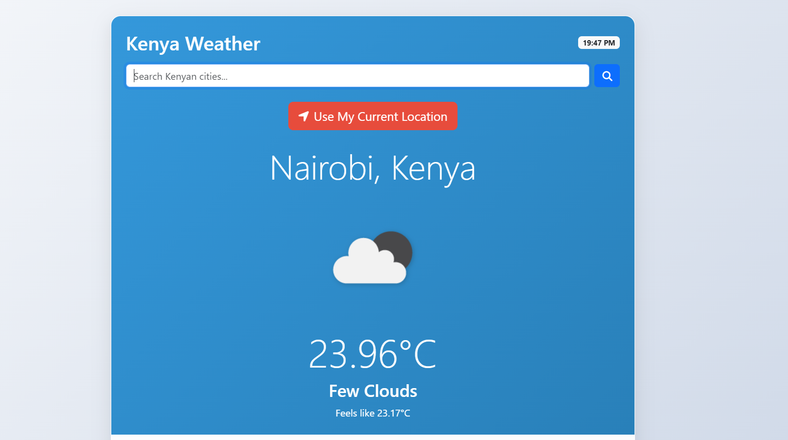
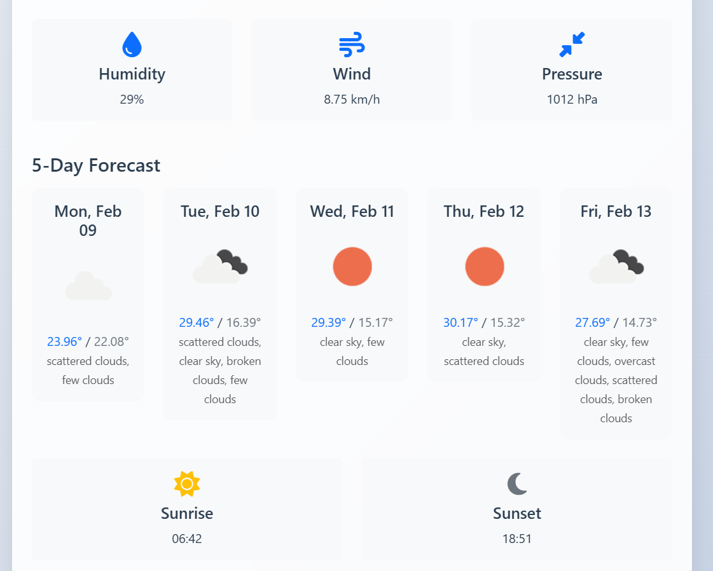

# 🌦️ Kenya Weather App

A Django-based web application that provides weather forecasts for Kenyan cities.

[](https://python.org)
[](https://djangoproject.com)
[](LICENSE)


## Features
- 📍 Search weather by Kenyan city
- 🌡️ Current temperature and conditions
- 🌧️ 5-day forecast visualization
- 🗺️ Kenyan city autocomplete
- 📱 Mobile-responsive design

## Screenshots





## Quick Start

### Prerequisites
- Python 3.8+
- Django 4.2+

### Installation
```bash
# Clone repository
git clone https://github.com/aizocraft/KenyaWeatherPy.git
cd KenyaWeatherPy

# Create virtual environment
python -m venv venv
source venv/bin/activate  # Linux/Mac
# venv\Scripts\activate  # Windows

# Install dependencies
pip install -r requirements.txt

# Run migrations
python manage.py migrate

# Load city data
python manage.py loaddata weather/data/kenyan_cities.json
```

### Configuration

Create .env file:
```bash
OPENWEATHER_API_KEY=3880cef656e66e784778b48dffb3ffca
```

Running Locally
```bash
python manage.py runserver
```
Open Link in Browser
